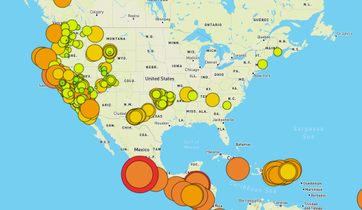

# mapping_earthquakes
## Overview
In this challenge an interactive map was created that shows tectonic plate lines and earthquakes for the past 7 days. This project shows that a relativetly simple code can create a useful and interactive map.
## Tools and technology used
- VSCode
- GitHub
- JavaScript
- HTML
- CSS
- Mapbox
- Leaflet
- data from earthquake.usgs.gov
### Screenshots
Map screenshot

Code snippet
